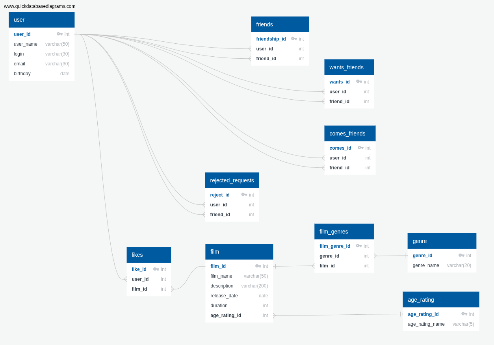

# java-filmorate (Java Filmorate)
### Описание (Description)  
The Filmorate project — это приложение для работы с базой данных фильмов.
### Основные возможности
- Хранение данных о фильмах
- Хранение данных о пользователях
- Возможность пользователям ставить лайки фильмам
- Возможность пользователям добавлять друг друга в друзья
- Возможность получать рейтинг TOP_N фильмов по количеству лайков
- Фильмы содержат возрастные ограничения по стандарту MPPA
- Реализована система жанров для фильмов
### Требования (Environmental Requirements) 
Для запуска проекта требуется: - Java версии 21 - Spring Boot версии 3.5.9
### Установка и запуск (Installation and Running) 
1. Убедитесь, что у вас установлена необходимая версия Java.  
2. Откройте терминал в корне проекта и выполните команду `mvn spring-boot:run` для запуска приложения.
### Примеры пользовательских запросов (Request Examples)

### Архитектура и структура проекта (Architecture and Project Structure) 
Проект использует Spring Boot и включает в себя следующие основные зависимости:
- spring-boot-starter-web 
- spring-boot-starter-test 
- spring-boot-starter-validation 
- spring-boot-starter-jdbc 
- h2database - lombok 
- logback-classic 
- logbook-spring-boot-starter
### Схема базы данных (Database map)

### Примеры запросов к базе данных:
1. Get TOP-10 films:
```sql
SELECT f.film_name,
       sum(l.user_id) AS rate
FROM films f
         JOIN likes l ON f.id = l.film_id
GROUP BY f.film_name
ORDER BY rate DESC
    LIMIT 10;
```

2. Get all the movies liked by users 5, 6 and 7 with a
   duration of more than 100 minutes and with genres of
   adventure, horror, action.
```sql
SELECT f.film_name,
       f.release_date,
       f.duration
FROM films f
WHERE f.id IN
      (SELECT l.film_id
       FROM likes l
       WHERE l.user_id IN
             (SELECT friend_id
              FROM friends fr
              WHERE fr.user_id IN (5, 6, 7)
             )
      )
  AND f.duration > 100
  AND f.id IN
      (SELECT fg.film_id
       FROM genres_of_films fg
       WHERE fg.genre_id IN
             (SELECT g.id
              FROM genres g
              WHERE g.genre_name
                       IN('Боевик', 'Триллер', 'Комедия')
             )
      );
```
