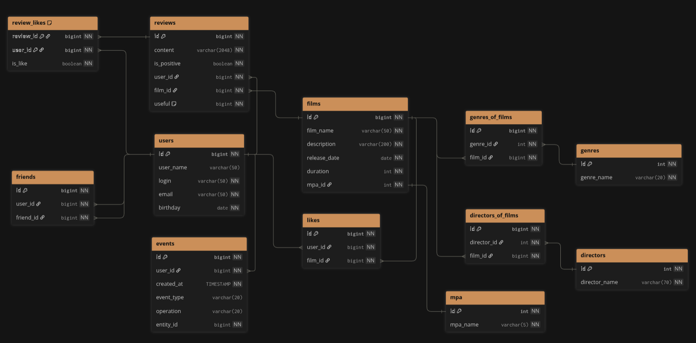

# java-filmorate


**The Filmorate project** — это бэкенд приложения для работы с базой данных фильмов.
А также площадка для общения и взаимодействия пользователей.


### Основные возможности
- Хранение данных о фильмах  
- Хранение данных о пользователях
- Возможность пользователям ставить лайки фильмам
- Возможность пользователям добавлять друг друга в друзья
- Возможность получать рейтинг TOP_N фильмов по количеству лайков
- Возможность получать общих с другим пользователем фильмов с сортировкой по их популярности
- Возможность заводить друзей
- Возможность оставлять отзывы о фильмах
- Фильмы содержат возрастные ограничения по стандарту MPPA
- Реализован поиск по названию и режиссерам
- Реализована система жанров для фильмов
- Есть лента событий

### Требования (Environmental Requirements) 
Для запуска проекта требуется: - Java версии 21  
Приложение работает на порту 8080
### Установка и запуск (Installation and Running) 
Откройте терминал в корне проекта и выполните команды для запуска приложения.   

**Вариант 1 Spring**  
 `mvn spring-boot:run`  
 - для остановки CTRL+C  

**Вариант 2 Java**  
`mvn package`  
`cd ./target/`  
`java -jar filmorate-0.0.1-SNAPSHOT.jar`  
- для остановки CTRL+C  

**Вариант 3 Docker**   
`mvn package`  
`sudo docker build -t filmorate-image .`  
`sudo docker run --name filmorate -p 8080:8080 filmorate-image`  
- для остановки `sudo docker stop filmorate`  
### Работа с приложением (Working with the app)
Для работы с приложением используйте REST-клиент
- Postman
- Insomnia
- RestFox
- и подобные
### Примеры пользовательских запросов (Request Examples)

```mermaid
%%{init: { 'mindmap': { 'maxNodeWidth': 500 } }}%%
mindmap
  root((API))
    GenreController
      🌐/genres
        GET getGenreById /genres/:id
        GET getAllGenres /genres
    UserController
      🌐/users
        GET findAll /users
        GET findById /users/:id
        POST create /users
        PUT update /users
        DELETE deleteUser /users/:id
      🌐/users/:id/friends
        GET getFriends /users/:id/friends
        GET getMutualFriends /users/:id/friends/common/:otherId
        PUT addToFriends /users/:id/friends/:friendId
        DELETE removeFromFriends /users/:id/friends/:friendId
      🌐/users/:id/feed
        GET getEventUsers /users/:id/feed
        GET getRecommendations /users/:id/recommendations
    FilmController
      🌐/films
        GET findAll /films
        GET findById /films/:id
        GET getTop /films/popular
        GET getCommonLikedFilms /films/common
        GET getSortedFilmsOfDirector /films/director/:directorId
        GET search /films/search
        POST create /films
        PUT update /films
        DELETE deleteFilm /films/:id
      🌐/films/:id/like
        PUT setLike /films/:id/like/:userId
        DELETE deleteLike /films/:id/like/:userId
    MpaController
      🌐/mpa
        GET getMpaById /mpa/:mpaId
        GET getAllMpa /mpa
    DirectorController
      🌐/directors
        GET getAllDirectors /directors
        GET getDirectorById /directors/:directorId
        POST createDirector /directors
        PUT updateDirector /directors
        DELETE deleteDirector /directors/:directorId
    ReviewController
      🌐/reviews
        GET findById /reviews/:id
        GET findByFilmId /reviews
        POST create /reviews
        PUT update /reviews
        DELETE delete /reviews/:id
      🌐/reviews/:id/like
        PUT addLike /reviews/:id/like/:userId
        DELETE removeLike /reviews/:id/like/:userId
      🌐/reviews/:id/dislike
        PUT addDislike /reviews/:id/dislike/:userId
        DELETE removeDislike /reviews/:id/dislike/:userId
```

### Схема базы данных (Database map)



### Примеры запросов к базе данных:
1. Get TOP-10 films:
```sql
SELECT f.film_name,
       sum(l.user_id) AS rate
FROM films f
         JOIN likes l ON f.id = l.film_id
GROUP BY f.film_name
ORDER BY rate DESC
    LIMIT 10;
```

2. Get all the movies liked by users 5, 6 and 7 with a
   duration of more than 100 minutes and with genres of
   adventure, horror, action.
```sql
SELECT f.film_name,
       f.release_date,
       f.duration
FROM films f
WHERE f.id IN
      (SELECT l.film_id
       FROM likes l
       WHERE l.user_id IN
             (SELECT friend_id
              FROM friends fr
              WHERE fr.user_id IN (5, 6, 7)
             )
      )
  AND f.duration > 100
  AND f.id IN
      (SELECT fg.film_id
       FROM genres_of_films fg
       WHERE fg.genre_id IN
             (SELECT g.id
              FROM genres g
              WHERE g.genre_name
                       IN('Боевик', 'Триллер', 'Комедия')
             )
      );
```
